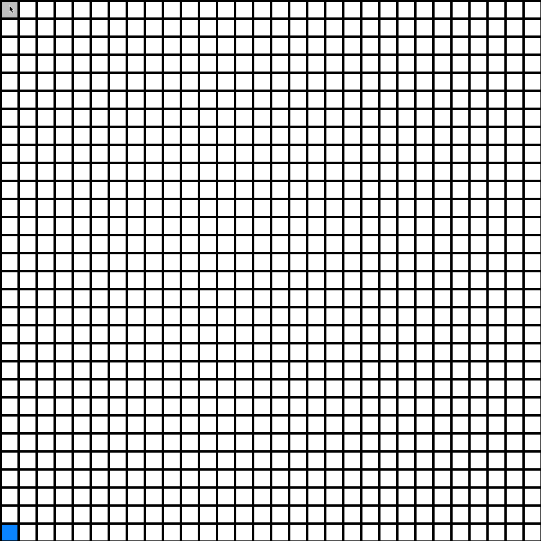

# Webgrid Eval

[](https://github.com/ofou/webgrid_eval/actions/workflows/ci.yml)
[](https://wakatime.com/badge/github/ofou/webgrid_eval)

Benchmark LLM vision + tool-use capabilities on Neuralink's cursor control task.

## Overview

At Neuralink, a game called [Webgrid](https://neuralink.com/webgrid) tests how precisely users can control a cursor. This benchmark evaluates LLMs on the same task: the model sees a screenshot of a grid with one blue target cell and uses tools (`screen`, `mouse_move`, `mouse_click`) to navigate the cursor to the target and click.

### Example Replay

<!-- markdownlint-disable MD033 -->
<figure align="center">
  
  <figcaption><em>gemini-3-flash-preview on 30×30 grid — 4 correct, 3 misclicks, 0.16 BPS (1 NTPM), in 70s task</em></figcaption>
</figure>
<!-- markdownlint-enable MD033 -->

### Human Baseline

For comparison: Neuralink's eighth clinical trial participant achieved 10.39 BPS controlling his computer with his brain; the highest mouse-based score mentioned is 17.1 BPS on a 35x35 grid (Neuralink employee).

### Metrics

The goal is to click targets on the grid as quickly as possible while minimizing misclicks. Score is measured in bits per second (BPS), derived from net correct clicks (NTPM) and grid size.

- **NTPM**: Net correct clicks = correct - incorrect
- **BPS**: `(NTPM / 60) * log2(N)` where N = grid cells (e.g., 64 for 8×8); BPS = 0 when NTPM ≤ 0

## Quick Start

### Installation

```bash
git clone git@github.com:ofou/webgrid_eval.git
cd webgrid_eval
make install-dev
```

### Run your first evaluation

```bash
# 1. Start the FastAPI server
make dev
```

```bash
# 2. In another terminal, run the evaluation
make eval ARGS="configs/openrouter.yaml"
```

## Usage

### Configure Models

Create a YAML configuration file (see `configs/` for examples):

```yaml
# configs/my_models.yaml
base_url: https://openrouter.ai/api/v1
grid_size: 64 # 8×8 grid (64 cells)
canvas_size: 256 # screenshot size in pixels
max_seconds: 70 # evaluation duration per model

models:
  - google/gemini-3-flash-preview
  - qwen/qwen3-vl-235b-a22b-instruct
```

Available configs:

- `configs/openrouter.yaml` - OpenRouter API (many models)
- `configs/google.yaml` - Google AI API (Gemini models)
- `configs/local.yaml` - Local LLM server (e.g., LM Studio, Ollama)

### Run Evaluation

```bash
# Run with a config file
make eval ARGS="configs/openrouter.yaml"

# With custom duration (seconds)
make eval ARGS="configs/openrouter.yaml --seconds 120"

# Cap images per API request (for models with limits)
make eval ARGS="configs/openrouter.yaml --max-images 8"
```

### API Endpoints

When the server is running (`make dev`):

- `GET /health` - Health check
- `POST /api/session/start` - Run single model evaluation
- `POST /api/eval/run` - Run batch evaluation (multiple models)

### Generate Replay GIFs

```bash
# Generate GIFs for all evaluation results
make gif

# Or for a specific evaluation folder
make gif ARGS="eval/model-name"
```

## Tools

The LLM agent has access to three tools:

| Tool          | Description                                                     |
| ------------- | --------------------------------------------------------------- |
| `screen`      | Returns current HUD + screenshot (like looking at your monitor) |
| `mouse_move`  | Move cursor by (dx, dy) pixels. Positive dx=right, dy=down      |
| `mouse_click` | Click at the current cursor position                            |

## Citation

If you use this software in your research, please cite:

```bibtex
@software{olivares2026webgrid,
  author  = {Olivares Urrutia, Omar},
  title   = {{Webgrid Eval: Benchmark for LLM Vision and Tool-Use Capabilities}},
  year    = {2026},
  month   = feb,
  url     = {https://github.com/ofou/webgrid_eval},
}
```

## Acknowledgments

- Inspired by [Neuralink's Webgrid](https://neuralink.com/webgrid)

## Contributing

Contributions are welcome!
