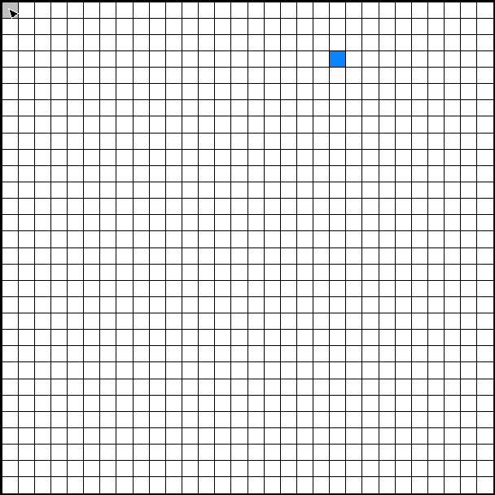

# Webgrid Eval

[](https://www.python.org/downloads/)
[](https://opensource.org/licenses/MIT)
[](https://github.com/psf/black)

Benchmark LLM vision + tool-use capabilities on Neuralink's cursor control task.

## Overview

At Neuralink, a game called [Webgrid](https://neuralink.com/webgrid) tests how precisely users can control a computer. This benchmark evaluates LLMs on the same task: the model sees a grid with one blue target cell and uses actions (move_cursor, click) to navigate the cursor to the target and click.

### Winner Replay

**qwen/qwen3-vl-235b-a22b-instruct** achieving 4.74 BPS:



### Human Baseline

For comparison: Neuralink's eighth clinical trial participant achieved 10.39 BPS controlling his computer with his brain; the highest mouse-based score mentioned is 17.1 BPS on a 35x35 grid (Neuralink employee).

## Leaderboard

| Rank | Model | NTPM | BPS |
|------|-------|------|-----|
| 1 | qwen/qwen3-vl-235b-a22b-instruct | 29.0 | 4.74 |
| 2 | google/gemini-3-flash-preview | 15.0 | 2.45 |
| 3 | google/gemini-3-pro-preview | 5.0 | 0.82 |
| - | anthropic/claude-sonnet-4.5 | -11.0 | 0.0 |
| - | openai/gpt-5.2-chat | -13.0 | 0.0 |

<details>
<summary>Metrics explained</summary>

The goal is to click targets on the grid as quickly as possible while minimizing misclicks. Score is measured in bits per second (BPS), derived from net correct clicks (NTPM) and grid size.

- **NTPM**: Net correct clicks = correct - incorrect
- **BPS**: (NTPM / 60) * log2(N) where N = grid cells (e.g., 900 for 30×30); BPS = 0 when NTPM <= 0

</details>

## Quick Start

### Prerequisites

- Python 3.10+
- [uv](https://github.com/astral-sh/uv) (recommended) or pip
- [OpenRouter API key](https://openrouter.ai/keys) (optional, for cloud models)

### Installation

```bash
# Clone the repository
git clone https://github.com/omarolivares/webgrid_eval.git
cd webgrid_eval

# Install dependencies
pip install -e .

# Or with development dependencies
pip install -e ".[dev]"

# Set your API key (for OpenRouter)
export OPENROUTER_API_KEY="sk-or-..."
```

### Run your first evaluation

```bash
# 1. Start the server
make dev

# 2. In another terminal, run the evaluation
make eval
```

## Usage

### Configure Models

Create a YAML configuration file:

```yaml
# configs/my_models.yaml
models:
  - qwen/qwen3-vl-235b-a22b-instruct
  - google/gemini-3-flash-preview

grid_size: 64  # 8x8 grid
canvas_size: 256  # screenshot size in pixels
max_seconds: 70  # evaluation duration per model
```

Find compatible models (vision + tools) at [OpenRouter Models](https://openrouter.ai/models).

### Run Evaluation

```bash
# Start the server
python -m webgrid_eval.main

# Run evaluation (in another terminal)
python -m webgrid_eval.run_eval configs/openrouter.yaml

# With custom duration
python -m webgrid_eval.run_eval configs/openrouter.yaml --seconds 120
```

### API Endpoints

When the server is running:

- `POST /api/eval/run` - Run batch evaluation
- `POST /api/eval/leaderboard` - Get leaderboard results

### Generate Replay GIFs

```bash
# Generate GIFs for all evaluations
make gif

# Or for a specific evaluation
python -m webgrid_eval.make_gif results/model-name
```

## Architecture

```
webgrid_eval/
├── webgrid_eval/        # Main package
│   ├── main.py          # FastAPI application
│   ├── openrouter.py    # LLM client and agent loop
│   ├── game_state.py    # Game state management
│   ├── tools.py         # Tool definitions
│   ├── screenshot.py    # Screenshot generation
│   ├── run_eval.py      # CLI evaluation runner
│   └── make_gif.py      # GIF generation
├── configs/             # Configuration files
├── examples/            # Usage examples
├── tests/               # Test suite
└── docs/                # Documentation
```

## Development

```bash
# Install with dev dependencies
pip install -e ".[dev]"

# Install pre-commit hooks
pre-commit install

# Run tests
make test

# Run linters
make lint

# Format code
make format
```

## Citation

If you use this software in your research, please cite:

```bibtex
@software{olivares2025webgrid,
  author = {Olivares, Omar},
  title = {Webgrid Eval: Benchmark for LLM Vision and Tool-Use Capabilities},
  url = {https://github.com/omarolivares/webgrid_eval},
  year = {2025}
}
```

## License

This project is licensed under the MIT License - see the [LICENSE](LICENSE) file for details.

## Acknowledgments

- Inspired by [Neuralink's Webgrid](https://neuralink.com/webgrid)
- Built with [FastAPI](https://fastapi.tiangolo.com/), [Pillow](https://python-pillow.org/), and [OpenAI](https://openai.com/)

## Contributing

Contributions are welcome! Please read [CONTRIBUTING.md](CONTRIBUTING.md) for details on our code of conduct and the process for submitting pull requests.

## Contact

For questions or support, please open an issue on GitHub.
